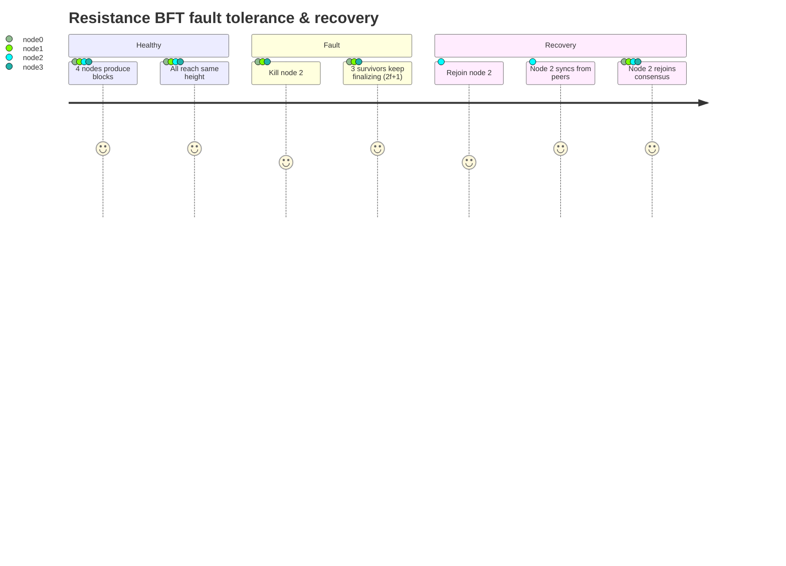
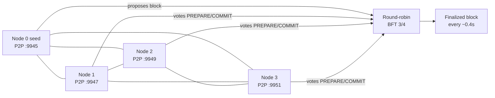
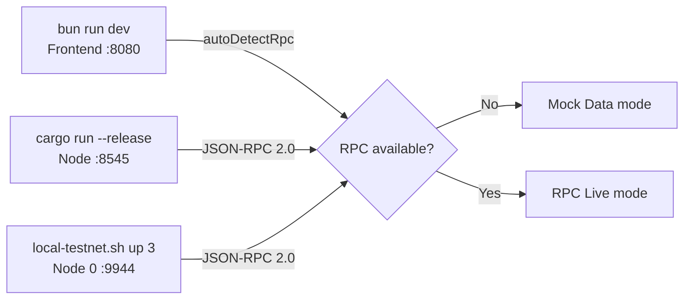

# RSTN

**The first post-quantum Layer 1 blockchain. Built in Rust. Resistant to Shor.**

RSTN is a sovereign Layer 1 blockchain designed with post-quantum cryptography from genesis. Every signature, every transport layer, every consensus message uses NIST-standardized PQ schemes (Dilithium3, Kyber768, SPHINCS+). When quantum computers break ECDSA and Ed25519, Resistance stands.

```
                    ┌─────────────────────────────────┐
                    │         RSTN            │
                    │   Post-Quantum Layer 1 · Rust     │
                    └─────────────────────────────────┘
                                   │
           ┌───────────┬───────────┼───────────┬───────────┐
           ▼           ▼           ▼           ▼           ▼
      ┌─────────┐ ┌─────────┐ ┌─────────┐ ┌─────────┐ ┌─────────┐
      │  Core   │ │  Crypto │ │   P2P   │ │ Storage │ │   RPC   │
      │ BFT+DAG │ │Dilithium│ │ libp2p  │ │  sled   │ │JSON-RPC │
       │ Sharding│ │ Kyber   │ │ Kademlia│ │  sled   │ │ 19 meth │
       └─────────┘ └─────────┘ └─────────┘ └─────────┘ └─────────┘
```

---

## What is Resistance?

| Feature | Specification |
|---|---|
| **Consensus** | BFT + DAG hybrid · 0.4s deterministic finality |
| **Cryptography** | Dilithium3 (FIPS 204) + Ed25519 hybrid · Keccak-512 · Kyber768 |
| **Throughput** | 250,000 TPS target (64 shards × 2,048 TPS + DAG parallelism) |
| **Sharding** | 64 dynamic shards · cross-shard lock-and-commit atomicity |
| **VM** | EVM-compatible + Move resources · parallel execution |
| **Token** | RSTN · 1B hard cap · zero minting · 50% fee burn (EIP-1559) |
| **Bridge** | BTC (threshold ECDSA + SPV) · ETH (lock/burn) · Quantum Migration Program |
| **License** | Apache 2.0 |

---

## Repository Structure

```
resistance/
├── src/                        # Frontend (React + Vite + Tailwind)
│   ├── pages/                  # Landing, Terminal, Dev Portal, 404
│   ├── components/
│   │   ├── landing/            # 3D hero, globe, tokenomics, architecture
│   │   ├── dashboard/           # Sidebar, header, charts, panels
│   │   ├── views/               # 17 terminal views (explorer, staking, bridge...)
│   │   └── ui/                  # shadcn/ui components
│   ├── lib/
│   │   ├── protocol.ts          # 2,300 lines — single source of truth
│   │   ├── api.ts               # Data boundary (mock ↔ RPC switch)
│   │   ├── wallet.ts            # Wallet integration layer
│   │   └── rstn-sdk.ts         # TypeScript SDK (Dilithium3 signing)
│   └── test/                    # E2E tests (wallet, staking, bridge, faucet)
│
├── rstn-node/                  # Rust blockchain node (7 crates)
│   ├── crates/
│   │   ├── rstn-core/          # Block, Transaction, Validator, BFT consensus
│   │   ├── rstn-crypto/        # Dilithium3, Kyber768, Keccak-512, PQ-VRF
│   │   ├── rstn-p2p/           # libp2p gossipsub + Kademlia DHT
│   │   ├── rstn-storage/       # sled-backed blocks, state, mempool
│   │   ├── rstn-vm/            # EVM + Move resources + PQ sig opcode
│   │   ├── rstn-rpc/           # JSON-RPC 2.0 (19 methods)
│   │   └── rstn-node/          # Binary entry point
│   └── ROADMAP_BACKEND.md       # 7-phase path to mainnet
│
├── rstn-wallet/                # Chrome/Firefox extension (Manifest V3)
│   ├── background.js            # Service worker: vault, keys, RPC
│   ├── crypto.js                # Dilithium3 (ML-DSA-65) — real implementation
│   ├── popup.js                 # Wallet UI
│   └── manifest.json            # MV3 manifest
│
├── WHITEPAPER.md                # Technical specification
├── DEPLOY.md                    # Deployment guide
├── SECURITY_INTERNAL.md        # Internal security documentation
└── INTEGRATION.md              # Frontend ↔ Backend integration guide
```

---

## Quick Start

### Prerequisites

| Component | Requirement |
|---|---|
| **Frontend** | Node.js 18+, Bun (recommended) or npm |
| **Node** | Rust toolchain (stable, 1.75+) — `curl --proto '=https' --tlsv1.2 -sSf https://sh.rustup.rs \| sh` |
| **macOS** | Xcode Command Line Tools — `xcode-select --install` |

### Frontend (this repo)

```bash
bun install           # or: npm install
bun run dev           # or: npm run dev   →  http://localhost:8080
bun run build         # Production build
bun run test          # E2E tests (Vitest)
bun run lint          # ESLint
```

### Node (Rust — post-quantum, pure-Rust crypto)

```bash
cd rstn-node
cargo build --release
cargo test -p rstn-crypto --release   # 19 PQ crypto tests (Dilithium3, Kyber768, PQ-noise)
cargo run --release -- --dev --port 8545   # Single-node dev mode, RPC on :8545, P2P on :9945
```

> The crypto layer uses **pure-Rust** crates (`pqc_kyber`, `pqc_dilithium`) — no C/AVX2
> assembly, so it compiles cleanly on macOS 14+ and Apple Silicon without extra flags.

### Multi-node testnet (BFT consensus)

Launch a local N-node testnet with one command — no Docker, no manual terminals.
Node 0 is the seed; all other nodes dial it and bootstrap. Each node gets its own
RPC + P2P port and data directory under `.testnet/`.

```bash
cd rstn-node
cargo build --release
chmod +x ./scripts/local-testnet.sh
./scripts/local-testnet.sh up 4        # launch a 4-node testnet (tolerates 1 fault)
./scripts/local-testnet.sh status      # show block height per node
./scripts/local-testnet.sh logs 1      # tail node 1 logs
./scripts/local-testnet.sh kill 2      # kill node 2 — survivors keep finalizing
./scripts/local-testnet.sh rejoin 2     # restart node 2 — it syncs & rejoins consensus
./scripts/local-testnet.sh down         # stop & clean all nodes
```

### Validated resilience cycle

The full fault-tolerance story is proven end-to-end with the testnet script:



| Node | RPC | P2P | Data dir |
|---|---|---|---|
| 0 (seed) | `:9944` | `:9945` | `.testnet/node0` |
| 1 | `:9946` | `:9947` | `.testnet/node1` |
| 2 | `:9948` | `:9949` | `.testnet/node2` |
| 3 | `:9950` | `:9951` | `.testnet/node3` |

The BFT threshold is `⌈2·n/3⌉ + 1` votes from active validators. This follows the
classic `n ≥ 3f+1` / `2f+1` rule, so fault tolerance is `f = ⌊(n−1)/3⌋`:

| Validators (n) | Threshold | Tolerated faults (f) | Survives killing 1 node? |
|---|---|---|---|
| 2 | 2 | 0 | ❌ (needs both) |
| 3 | 3 | 0 | ❌ (needs all 3) |
| **4** | **3** | **1** | **✅ (3 of 4 survive)** |
| 7 | 5 | 2 | ✅ |

**To test fault tolerance, run 4 nodes** and kill one — the remaining 3 still
reach the `3/4` supermajority and keep finalizing. With 3 nodes, killing one
stalls the chain (only 2 votes < threshold 3). The leader rotates round-robin
each finalized block, and a sync protocol + re-propose timeout let nodes that
start late catch up without stalling.



### Wallet (Chrome/Firefox extension)

```bash
# Load unpacked extension:
# 1. Open chrome://extensions/
# 2. Enable Developer mode
# 3. Click "Load unpacked"
# 4. Select rstn-wallet/ folder
```

---

## Connecting Frontend to Node

1. Start the node (see above) — RPC listens on `http://localhost:8545`
   (dev mode) or `http://localhost:9944` (testnet node 0)
2. Start the frontend — `bun run dev`
3. Open `http://localhost:8080/terminal`
4. The connection badge (top-left) auto-detects the node and switches from
   "Mock Data" to **"RPC Live"**
5. All terminal views (Explorer, Staking, Wallet, Transparency) now read live
   on-chain data



See [INTEGRATION.md](./INTEGRATION.md) for full details.

---

## Key Documentation

| Document | Description |
|---|---|
| [WHITEPAPER.md](./WHITEPAPER.md) | Full technical specification: consensus, crypto, sharding, tokenomics, bridge |
| [VERIFICATION.md](./VERIFICATION.md) | **Verify every claim yourself** — map of claims → code → test commands → honest status |
| [NO_ADMIN_KEY.md](./NO_ADMIN_KEY.md) | **No unilateral power** — evidence that no one (including the founder) can change the rules after launch |
| [DEPLOY.md](./DEPLOY.md) | Step-by-step deployment: local → testnet → mainnet |
| [rstn-node/ROADMAP_BACKEND.md](./rstn-node/ROADMAP_BACKEND.md) | 7-phase roadmap from prototype to mainnet |
| [rstn-node/TIER3_STATUS.md](./rstn-node/TIER3_STATUS.md) | Tier 3 features: what's implemented vs. future research (honest) |
| [INTEGRATION.md](./INTEGRATION.md) | Frontend ↔ Backend data boundary guide |
| [SECURITY_INTERNAL.md](./SECURITY_INTERNAL.md) | Internal security framework (confidential) |
| [rstn-node/README.md](./rstn-node/README.md) | Rust node architecture and CLI |
| [rstn-wallet/README.md](./rstn-wallet/README.md) | Wallet extension architecture |

---

## Verify It Yourself

Don't trust — verify. Every claim Resistance makes can be checked against the code:

```bash
git clone https://github.com/XMECATRONX/RESISTANCE
cd RESISTANCE/rstn-node

# Build the full node (must finish with "Finished release")
cargo build --release

# Run all tests (141 automated tests)
cargo test --release -p rstn-vm --test opcodes       # 33 EVM opcodes
cargo test --release -p rstn-vm --test adversarial   # 17 DoS/fuzz tests
cargo test --release -p rstn-core --test consensus   # 27 BFT consensus tests
cargo test --release -p rstn-core --test adversarial # 16 attack-vector tests
cargo test --release -p rstn-core --test tier3       # erasure + governance + circuit breakers

# Test fault tolerance live (kill a node, survivors keep finalizing, rejoin syncs)
./scripts/local-testnet.sh up 4
./scripts/local-testnet.sh kill 2    # 3 of 4 survive (BFT 2f+1)
./scripts/local-testnet.sh rejoin 2  # node 2 syncs from peers and rejoins

# Test the bridge end-to-end (lock & mint, burn & release)
cd ../rstn-deploy && ./test-bridge.sh

# Verify no admin key exists (no unilateral power)
grep -ri "admin\|owner\|superuser" crates/rstn-core/src/ crates/rstn-node/src/
grep -ri "fn mint\|increase_supply" crates/rstn-core/src/  # no minting function
```

See [VERIFICATION.md](./VERIFICATION.md) for the full honest map of what's
implemented vs. what's roadmap. See [NO_ADMIN_KEY.md](./NO_ADMIN_KEY.md) for
evidence that no one can change the rules after launch.

---

## Cryptography

All primitives are post-quantum (NIST FIPS 203/204/205):

| Primitive | Algorithm | Standard | Security |
|---|---|---|---|
| Signatures (primary) | CRYSTAL-Dilithium3 | FIPS 204 (ML-DSA-65) | 128-bit PQ |
| Signatures (hybrid) | Ed25519 | RFC 8032 | 128-bit classical |
| Signatures (fallback) | SPHINCS+ | FIPS 205 | 128-bit PQ (hash-based) |
| Key exchange | Kyber768 | FIPS 203 (ML-KEM-768) | 128-bit PQ |
| Hash | Keccak-512 (SHA-3) | FIPS 202 | 256-bit PQ |
| VRF | Lattice-based (Module-LWE) | — | 128-bit PQ |
| Transport | pq-noise (Kyber + X25519) | draft libp2p | 128-bit PQ hybrid |
| ZK proofs | zk-STARK (hash-based) | — | PQ-resistant |

---

## Tokenomics

```
Supply: 1,000,000,000 RSTN (hard cap, zero minting)

Distribution:
  55% — Proof of Participation (staking rewards, halving every 4 years)
  20% — Community & Ecosystem (grants, governed on-chain)
  10% — Team (vesting on-chain, 4 years, 12-month cliff)
  10% — Treasury (governed on-chain from block 0)
   5% — Testnet Airdrop (Proof of Participation)

Fee mechanics:
  50% gas burned (EIP-1559 style)
  30% to block validator
  20% to treasury

Bridge revenue (60/30/10):
  60% — Buyback & Burn of RSTN
  30% — Staker rewards
  10% — Treasury (audits, bug bounty, development)

Zero ICO. Zero pre-sale. Zero VC. Fair launch.
```

---

## License

Apache 2.0 — see [LICENSE](#). Patent defensive clause included.

## Disclaimer

RSTN is experimental open-source software. It is not an investment. There is no guarantee of value. Use at your own risk.
